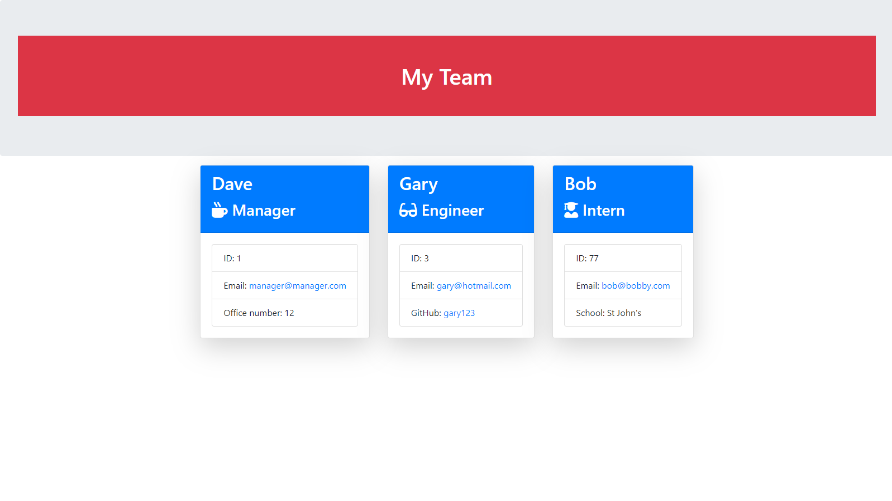
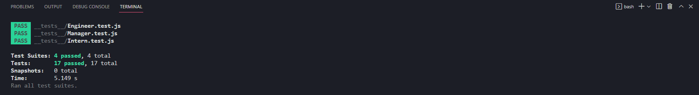

# cli-profile-builder

CLI-based Node.js app for generating a clean and professional HTML team profile

## Description

**cli-profile-builder** is a versatile tool that enables users to effortlessly generate HTML files by providing input through the command line interface.

## Installation

To install **cli-profile-builder**, use the following command:

npm i

[Link to cli-profile-builder repository](https://github.com/lav3ll/cli-profile-builder)

## Usage

Screenhot of the cli-profile-builder

## Tests

Has passed all tests run

**Key Features:**

- Effortless Profile Building: CLI Profile Builder provides a seamless experience for constructing profiles for each team member. Easily input essential details such as employee office and manager with simplicity and ease.

- Customizable Profiles: Tailor profiles to suit the specific needs of your team. CLI Profile Builder empowers users to customize and define details for each team member, ensuring a personalized touch to every profile.

- Efficient Team Documentation: Streamline the process of creating team documentation by utilizing CLI Profile Builder. Say goodbye to complex manual procedures and welcome a hassle-free way to document and manage crucial team information.

## Credits

Skills For Life
Ed X

## License

MIT License
